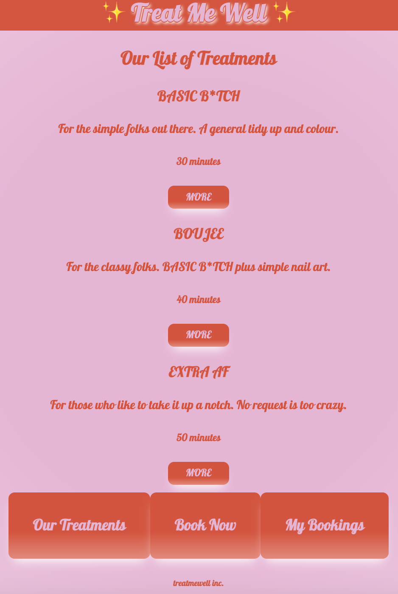
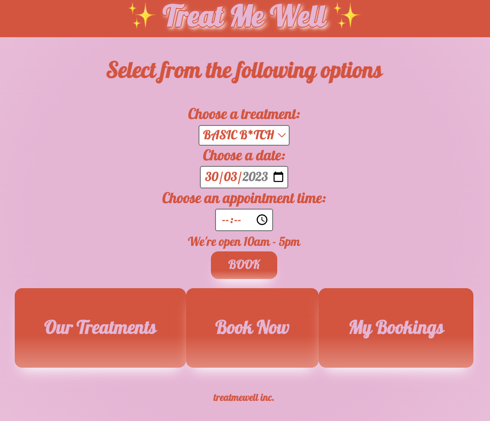
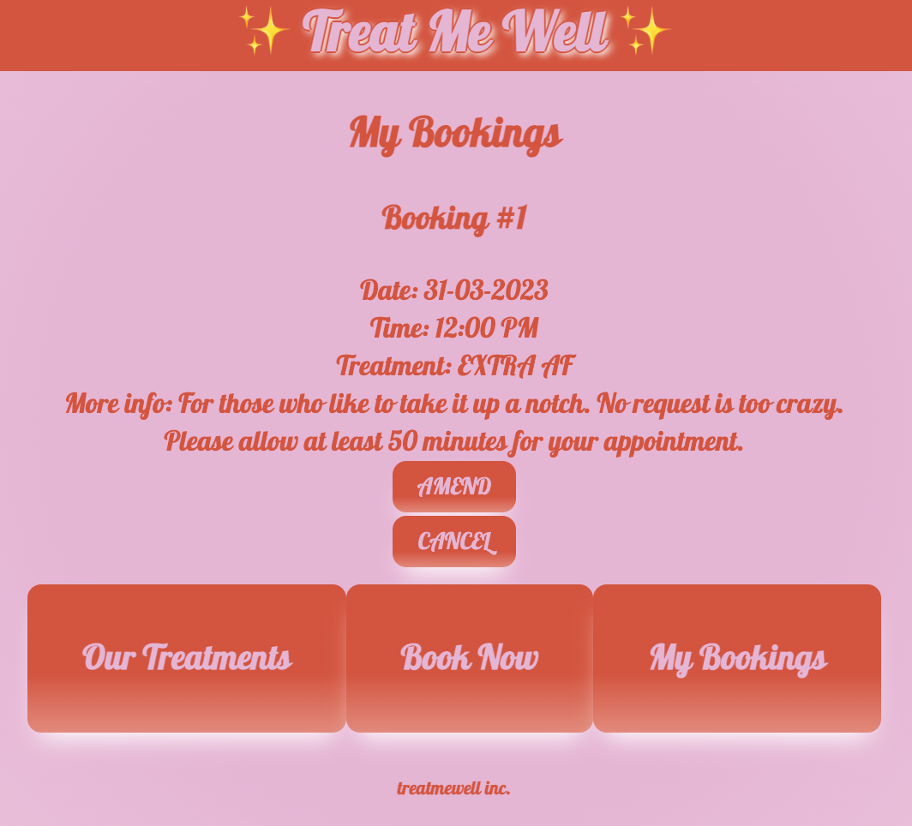

# python-project

How to run the app

1. In your terminal, create a database called 'my first app'.
Run command:
```createdb myfirstapp```
2. Within the python-project file, initialise and populate database using the pythonapp.sql file.
Run command:
```psql -d myfirst app -f pythonapp.sql```
3. Run flask to open the app locally.
Run command:
```flask run```
4. Open app by opening (http://localhost:4999/) in your browser, preferably in Chrome:

5. Use the app to view all available treatments (http://localhost:4999/treatments) by clicking on 'Our Treatments':

6. Click into each treatment for more information.
7. Click 'Book' from the individual treatment page or 'Book Now' from the navigation buttons to be taken to a booking form:

8. To view all bookings made, click on 'My Bookings':

9. Here you have the option to amend or cancel your booking.
10. To exit the app, end flask run.
Run command:
```Ctrl and C```